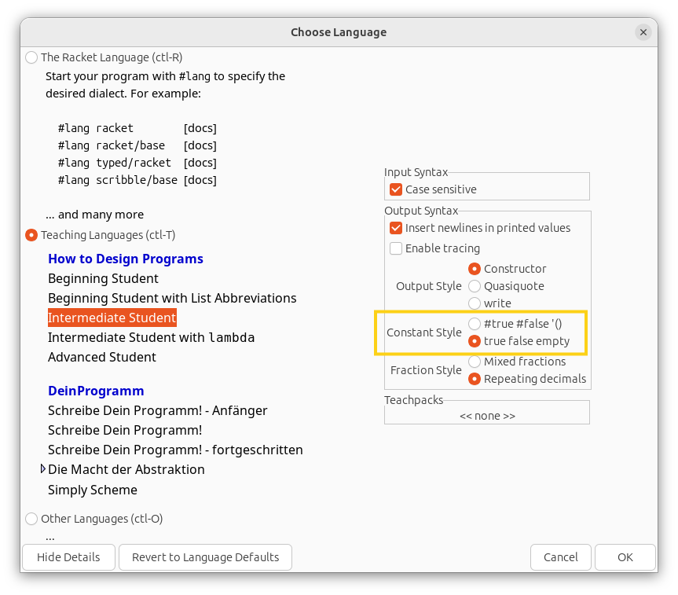
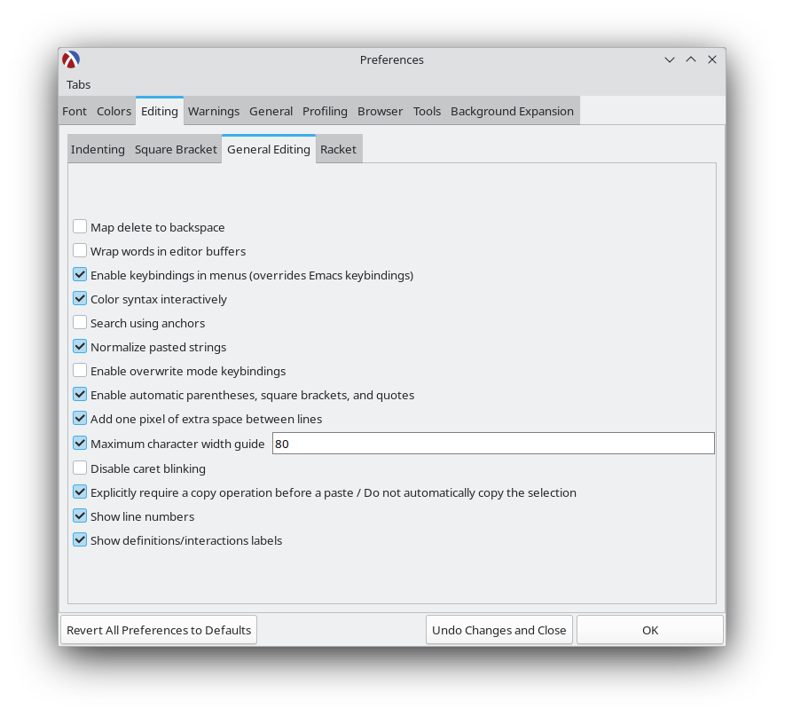

# Systematic Program Design

This course has been developed by UBC and is available from Edx. We recommend you to do it from the archived version on Edx.

> This programming course takes a unique approach, as it focuses on learning a systematic programming method rather than a programming language. This practical approach will help you channel your creativity so that you can program well in any language.

**Course Link:** <https://learning.edx.org/course/course-v1:UBCx+SPD1x+2T2015>

Alternative Links:

- <https://www.edx.org/course/how-to-code-simple-data> (Up to Week 6A)
- <https://www.edx.org/course/how-to-code-complex-data> (Week 6B onwards)

## Instructions

**Note:** These instructions are for the archived version of the course on Edx, which we recommend. They don't apply to other versions of the course.

- The course does not have a homepage on Edx, but don't worry about it. Open the [link](https://learning.edx.org/course/course-v1:UBCx+SPD1x+2T2015) given above, log in (if you are not logged in) and then enroll in the course.
- Work through Week 1A to Week 6A as given in the course overview. Watch the videos, do the exercises, and then solve the problems from the problem bank.
- After you complete, Week 6A, do the [space invaders problem](https://github.com/ossu/spd-starters/blob/main/final/space-invaders-starter.rkt). You can find further instructions here: [Space Invaders Instructions](space-invaders-instructions.png). You can watch a sample run of the game [here](https://www.youtube.com/shorts/wUg3psZl7vM).
- Then, work through Week 6B onwards. Watch the videos, do the exercises, and then solve the problems from the problem bank.
- After you complete all the modules in the course, do the [TA solver problem](https://github.com/ossu/spd-starters/blob/main/final/ta-solver-starter.rkt). You will find the instructions in the starter file.
- The problem bank tab has many additional problems. We suggest you to solve all of them to boost your understanding.
- Some links to starter files in the course are no longer working. You can download the starter files from this github repository: <https://github.com/ossu/spd-starters>. You can download a zip file of all the starter files using [this link](https://github.com/ossu/spd-starters/archive/refs/heads/main.zip).
- You won't be able to submit your responses for the exercises, but you can see their answers by clicking on "Show Answer". Check your answers honestly.
- You won't be able to submit the problem bank problems, but they provide sample solutions. You can match your solution with it.
- While there are ways to do this course in other IDEs, we suggest you to use Dr. Racket, as configuring the problem starter files for other IDEs is not worth the effort. 
- If you are stuck somewhere, feel free to ask questions. You can join the OSSU chat for this course here:
  - Chat for discussions up to Week 6A: <https://discord.gg/RfqAmGJ>
  - Chat for discussions from Week 6B onwards: <https://discord.gg/kczJzpm>

## Notes

- Dr. Racket defaults to using the newer notation `#true #false '()`. You can configure Dr. Racket to use the notation used by the course by clicking in menu bar on Language > Choose Language. Then choose the required language (BSL, ISL or other variants). Then click on "Show details" in the bottom left of the window. Then choose `true false empty` in "Constant Style" field. Run your file again to make sure it uses the new configuration.

- You can enable automatic closing of parentheses, brackets, and quotes. Click on Edit in the Menu Bar > Preferences > Go to Editing Tab > Go to General Editing Sub-tab > Check the "Enable automatic parentheses, square brackets, and quotes" checkbox.

- You can use Ctrl + I to reindent the whole file.

- If you are on Windows or Linux, use Alt + Backspace to delete whole words.

## FAQ

### This course is boring. Can I skip it?

**No.** This course may seem boring at first, but we suggest working though it. This is a great course, and it will probably change the way you think. Many students who found this course boring at first became a fan of the course by the time they completed it. Be very careful. The early parts (especially the rules about how evaluation works) plays a huge role in understanding how code works and gets executed for the rest of the course.

### Why is this course taught using BSL? Would it not make more sense to teach it in an industry standard language?

This is an intentional choice, and here's why:

1. Lisp is the lingua franca of computer scientists -- by which we mean, PhD algorithm researchers. There are some good and some merely historical reasons for this, but it's a fact of life, so if you want to read white papers you're going to want to read Lisp. BSL is a good introduction, and frankly once you get over the parenthesis hell and once you know any Lisp you know how to read them all.

2. This is the first computer science course in most people's curricula that isn't centered around teaching you how to use a language. Because the point of computer science isn't to teach you a language. Or to teach you to code. Or to teach you to be a fullstack software engineer. Computer Science is a very narrowly-applied applied math with wide-ranging practical usage.  But if you strip away all the qualifying language, it's math. Which means it has certain overarching rules that are completely, totally independent of your implementation language.

This course is built in a throwaway student language, specifically so you don't focus on the language and instead focus on what you're doing with the language. We don't care about public static void main or PEP8 style. We want to see ways to structure a program in any language. So we focus not on the things that make Java unique, and not on the things that make Python unique, and instead focus on the things that make code better.

It might seem rough to learn a new language just to take this course, but BSL frees you from having to worry about style linting or runtime issues or code compartmentalization or compiling or coding environment. It's a gift. Take it. The design patterns are hard enough.

### Why there are different course versions, HTC, SPD? Why do you recommend the archived version?

There are two reasons people do these courses:

- The Knowledge
- The Certificate

OSSU assumes you're in it for the knowledge. You can have that for free. If you're doing it for the knowledge you don't need to submit your homework. You just need to do the homework.

If you want the recognition that you've done the thing, then you're in it for the certificate. You can't have the certificate for free. You have to pay for that.

There's no reason for you to submit homework sets unless you're doing it for the certificate -- If you're doing that, you can't actually get a certificate from the SPD course (because the course is expired) so you're in the wrong place.

If you want a certificate, then you need to take How To Code and you need to pay for it.

But you don't need to pay for anything in OSSU. We suggest you take SPD because the access to the information is better (because the course is expired) and it's more than sufficient for obtaining the knowledge.

TL;DR:

    If you're in it for the knowledge, take SPD -- it's free but inactive
    If you're in it for the certificate, take and pay for How To Code -- it's still an active course

### Can I do this course in another programming language?

This course has really integrated with the programming languages it uses. We suggest you to use the language specified by the course. While, the concepts you learn from this course are applicable anywhere, trying to do the course with another language is not really sensible, and would just lead to wastage of time.

### Can I use another IDE? I don't like Dr. Racket.

The programs in this course embed pictures and rich-text blocks in the code, which means, the files cannot be opened by other IDEs. While it is possible to prepare the starter files for use with other IDEs, you need Dr. Racket for that, and the time needed to do that can be better utilized in learning the concepts taught by the course.

### How do I test functions which are supposed to output random values?

You can use `check-random` to test those functions. You can [learn more about it here](https://docs.racket-lang.org/htdp-langs/beginner-abbr.html#(form._((lib._lang%2Fhtdp-beginner-abbr..rkt)._check-random))). It is needed for the Space Invaders project.

## Credits

The problem starter files and the space invaders instructions were taken from the course ["Systematic Program Design" on Edx](https://learning.edx.org/course/course-v1:UBCx+SPD1x+2T2015), licensed under [CC BY-NC-SA](https://creativecommons.org/licenses/by-nc-sa/4.0/) license.
